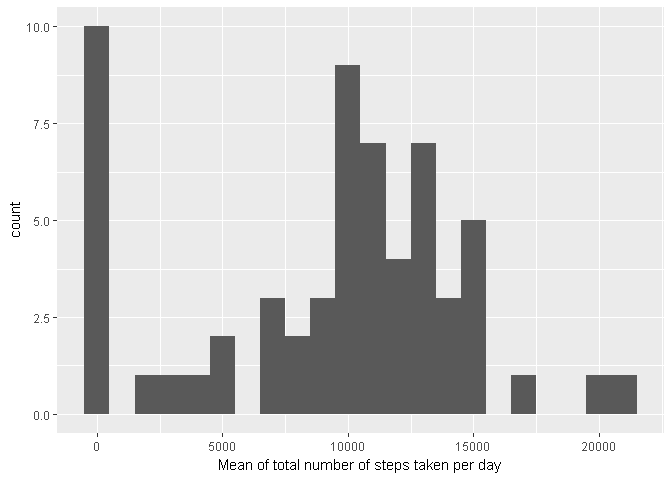
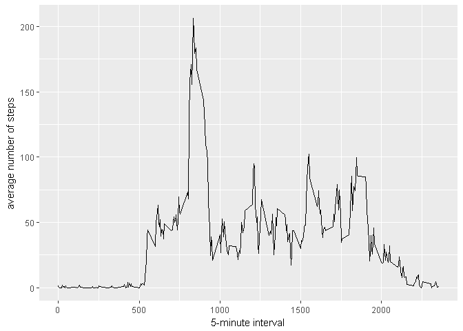
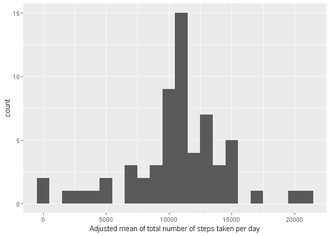
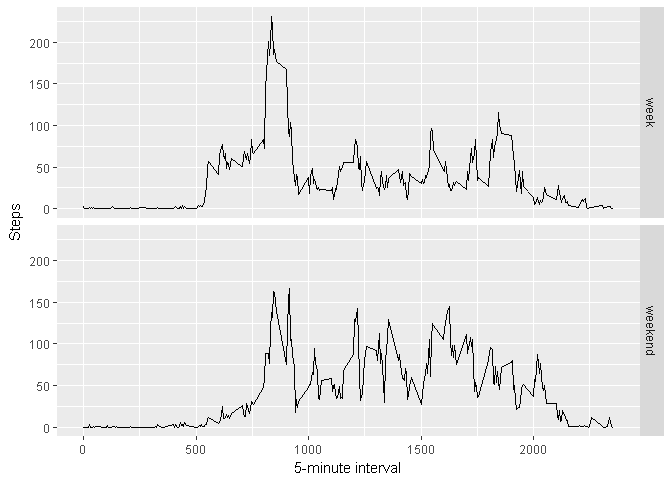

# Reproducible Research: Peer Assessment 1


## Loading and preprocessing the data

```r
echo = TRUE
unzip ("activity.zip")
activity <- read.csv("activity.csv" , sep = "," , header = TRUE)
```


## What is mean total number of steps taken per day?

```r
echo = TRUE
library(ggplot2)
steps <- tapply(activity$steps , activity$date, FUN = sum , na.rm =TRUE)
meanSteps <- mean(steps, na.rm = TRUE)
medianSteps <- median(steps, na.rm = TRUE)
paste("Mean of steps: " , meanSteps)
```

```
## [1] "Mean of steps:  9354.22950819672"
```

```r
paste("Median of steps: " , medianSteps)
```

```
## [1] "Median of steps:  10395"
```

```r
qplot(steps, binwidth=1000, xlab="Mean of total number of steps taken per day")
```

<!-- -->


## What is the average daily activity pattern?

```r
echo = TRUE
library(ggplot2)
average <- aggregate(x=list(steps = activity$steps) , by = list(interval = activity$interval) , FUN=mean, na.rm=TRUE)
maxAverage <- average[which.max(average$steps),]
paste("This interval contains max average: " , maxAverage$interval)
```

```
## [1] "This interval contains max average:  835"
```

```r
paste("Average for this interval: " , maxAverage$steps)
```

```
## [1] "Average for this interval:  206.169811320755"
```

```r
ggplot(data=average, aes(x=interval, y=steps)) +
    geom_line() +
    xlab("5-minute interval") +
    ylab("average number of steps")
```

<!-- -->


## Imputing missing values

```r
echo = TRUE
missing <- is.na(activity$steps)
paste("Count of missing values: ", table(missing)["TRUE"])
```

```
## [1] "Count of missing values:  2304"
```

```r
#to fill missing values mean of interval can be used

meanValue <- function(steps, interval) {
    fill <- NA
    if (!is.na(steps))
        fill <- c(steps)
    else
        fill <- (average[average$interval==interval, "steps"])
    return(fill)
}

activity$steps <- mapply(meanValue, activity$steps, activity$interval)

#replot
newSteps <- tapply(activity$steps , activity$date, FUN = sum)
newMeanSteps <- mean(newSteps)
newMedianSteps <- median(newSteps)
paste("New mean of steps: " , newMeanSteps)
```

```
## [1] "New mean of steps:  10766.1886792453"
```

```r
paste("New median of steps: " , newMedianSteps)
```

```
## [1] "New median of steps:  10766.1886792453"
```

```r
qplot(newSteps, binwidth=1000, xlab="Adjusted mean of total number of steps taken per day")
```

<!-- -->

## Are there differences in activity patterns between weekdays and weekends?

```r
echo = TRUE
library(chron)
activity$day <- is.weekend(as.Date(activity$date))
labels <- c("TRUE" = "weekend", "FALSE" = "week")
newAverage <- aggregate(steps ~ interval + day, data=activity, mean)
ggplot(newAverage, aes(interval, steps)) + geom_line() + facet_grid(day ~ . , labeller = as_labeller(labels)) + xlab("5-minute interval") + ylab("Steps")
```

<!-- -->
